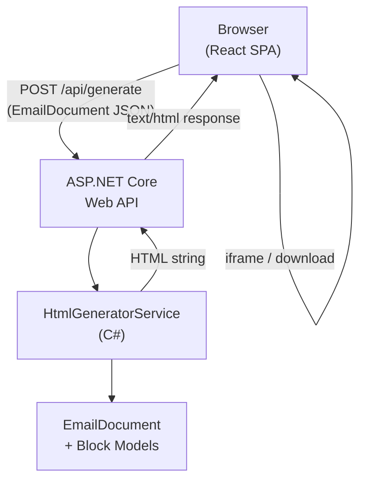
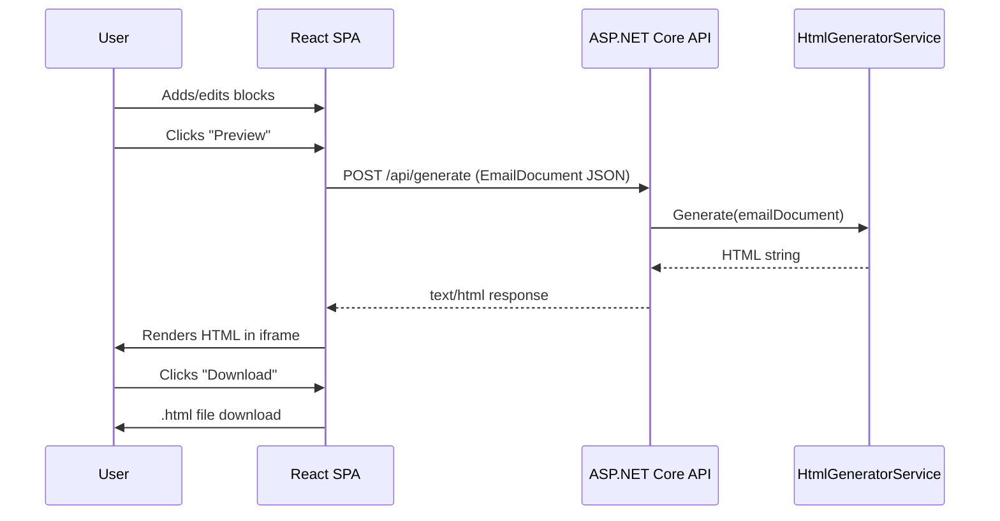

# Architecture

## Overview

The Email Editor is a single-host, locally-running web application. ASP.NET Core serves both the REST API and the React SPA static files from a single process on `localhost`.

## Layers

### 1. Domain Models (`EmailEditor/Models/`)
Pure C# records. No behavior, no rendering — just the data contracts the entire system is built on.

See [[domain-model]].

### 2. HTML Generator (`EmailEditor/Services/`)
The core of the application. Takes an `EmailDocument` and returns a cross-email-client HTML string. All layout uses table-based structure with inlined CSS.

See [[html-generator]].

### 3. Web API (`EmailEditor/`)
Minimal ASP.NET Core API. Exposes `POST /api/generate`. In production, also serves the React SPA from `wwwroot/`.

See [[api]].

### 4. React SPA (`EmailEditor/ClientApp/`)
A Vite + React (TypeScript) app. Handles all user interaction: block palette, drag-drop canvas, block editors, preview, and download.

See [[frontend]].

## Data Flow

## Key Constraints

> [!important] Cross-Email-Client HTML Rules
> - **No flexbox** — not supported in Outlook
> - **No CSS grid** — not supported in Outlook
> - **Table-based layout only** — every structural element uses `<table>`
> - **All CSS inlined** — no `<style>` blocks, no class-based styling
> - **VML for Outlook buttons** — use `<!--[if mso]>` conditional comments for button backgrounds

## Dev vs Production

| Mode | SPA serving | API proxy |
|------|------------|-----------|
| Development | Vite dev server (`localhost:5173`) | Vite proxies `/api/*` → `localhost:5261` |
| Production | ASP.NET Core serves `wwwroot/` | Same origin, no proxy needed |
