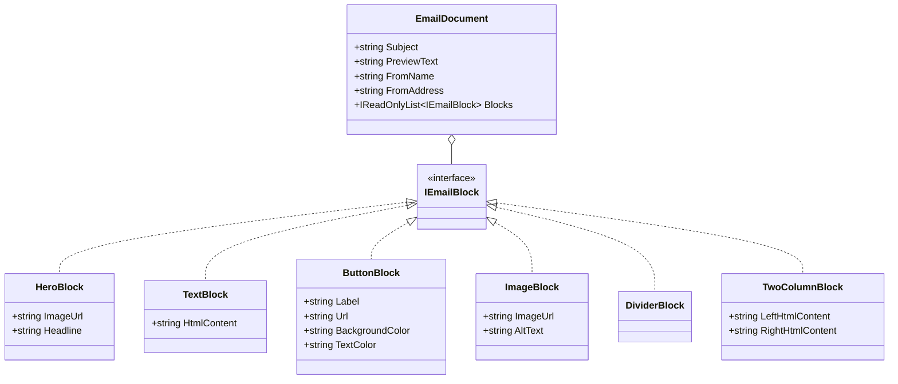

# Domain Model

All types live in `EmailEditor/Models/`. They are immutable C# records with no rendering logic.

## EmailDocument

The top-level envelope passed to the HTML generator and the API.

```csharp
public record EmailDocument(
    string Subject,
    string PreviewText,
    string FromName,
    string FromAddress,
    IReadOnlyList<IEmailBlock> Blocks
);
```

| Property | Purpose |
|----------|---------|
| `Subject` | Email subject line |
| `PreviewText` | Inbox snippet (rendered as invisible text in HTML head) |
| `FromName` | Sender display name |
| `FromAddress` | Sender email address |
| `Blocks` | Ordered list of content blocks |

## IEmailBlock

Marker interface implemented by all block types.

```csharp
public interface IEmailBlock { }
```

## Block Types

### HeroBlock

Full-width banner image with a headline.

```csharp
public record HeroBlock(string ImageUrl, string Headline) : IEmailBlock;
```

### TextBlock

Rich text paragraph. `HtmlContent` is Quill output — post-processed server-side to inline all styles before rendering.

```csharp
public record TextBlock(string HtmlContent) : IEmailBlock;
```

> [!warning] HTML Content
> `HtmlContent` must be sanitized server-side before rendering to prevent XSS in the preview iframe.

### ButtonBlock

Call-to-action button. Uses table-cell rendering with VML fallback for Outlook.

```csharp
public record ButtonBlock(
    string Label,
    string Url,
    string BackgroundColor = "#000000",
    string TextColor = "#ffffff"
) : IEmailBlock;
```

### ImageBlock

Standalone image with alt text.

```csharp
public record ImageBlock(string ImageUrl, string AltText) : IEmailBlock;
```

### DividerBlock

Horizontal rule / spacer. No configurable properties.

```csharp
public record DividerBlock() : IEmailBlock;
```

### TwoColumnBlock

Two side-by-side Quill content areas, each 50% width.

```csharp
public record TwoColumnBlock(string LeftHtmlContent, string RightHtmlContent) : IEmailBlock;
```

## Type Hierarchy



## Related

- [[architecture]] — where models fit in the system
- [[html-generator]] — how models are rendered to HTML
- [[api]] — how models are received over HTTP
